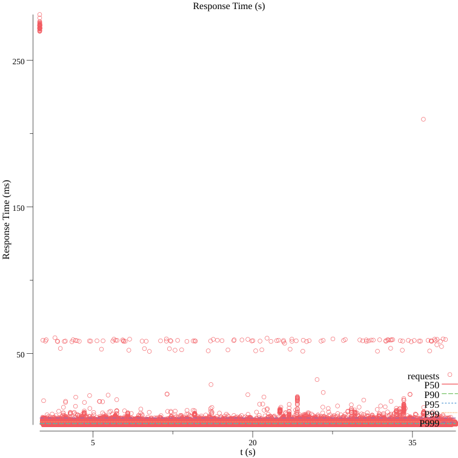

# HTTP stress testing of registry.k8s.io

## Install dependencies

```bash
go install github.com/rakyll/hey@latest
go install github.com/asoorm/hey-hdr@latest
```

## Running tests

Setting `$RPM` to the amount of requests per-minute and `$DOMAIN` to the target domain,
the following commands will result in three files in `/tmp/hey-stress-test-"${DOMAIN}"/`

- results.csv :: the raw data from the run
- results.scatter.png :: the results displayed in a png rendered graph
- results.hdr.csv :: sorted stats of the run

```bash
DOMAIN=registry.k8s.io
mkdir -p /tmp/hey-stress-test-"${DOMAIN}"

hey \
  -disable-redirects \
  -z 60s \
  -c 200 \
  -n 1000000 \
  -o csv \
  https://"${DOMAIN}/v2/" \
    > /tmp/hey-stress-test-"${DOMAIN}"/results.csv

< /tmp/hey-stress-test-"${DOMAIN}"/results.csv \
  hey-hdr -out /tmp/hey-stress-test-"${DOMAIN}"/results
```

It will output a graph like this


Configurations:

- 10,000 requests in 30s :: `-z 30s -n 10000`
- 10,000,000 requests in 30s :: `-z 30s -n 10000000`
- 100,000,000 requests in 60s :: `-z 30s -n 100000000`
