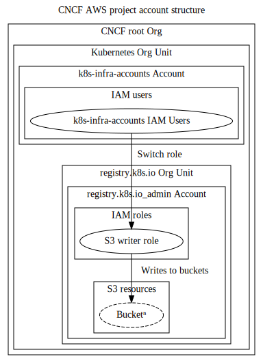

# registry.k8s.io

Kubernetes's multi-cloud registry.

For more details on the design and implementation see the source repo: https://github.com/kubernetes/registry.k8s.io

Most of the deployment configuration is in [infra/gcp/terraform/k8s-infra-oci-proxy](./../infra/gcp/terraform/k8s-infra-oci-proxy) (staging instance for development only) and [infra/gcp/terraform/k8s-infra-oci-proxy-prod](./../infra/gcp/terraform/k8s-infra-oci-proxy) (production / end users).

## Accounts

To host the /registry.k8s.io/ redirector, several resources are located in accounts across cloud providers.

## GCP

The GCP projects are under the standard kubernetes.io GCP org along with the other
community infrastructure managed in this repo.

### AWS

In AWS the account to provide registry.k8s.io will be structured as follows

Terraform management infra on AWS to support registry.k8s.io is available [here](../infra/aws/terraform/registry.k8s.io/README.md)
